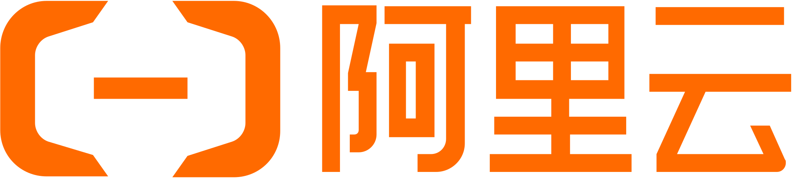
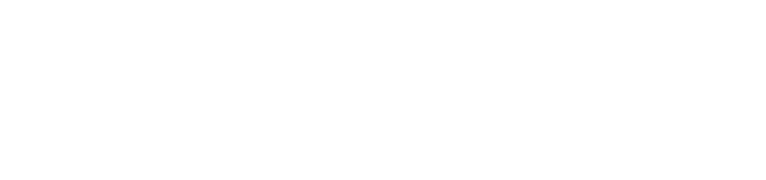
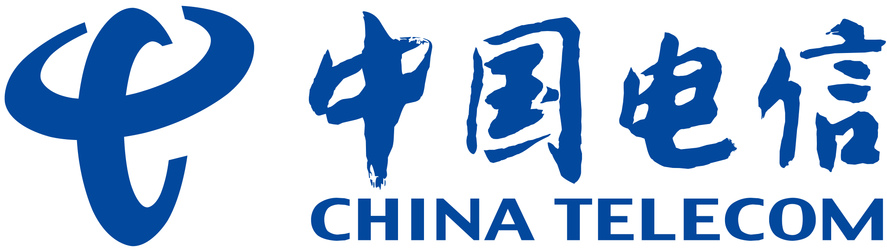
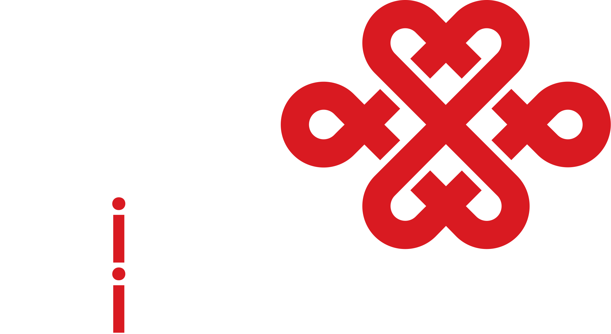

# L-Icon

基於各大品牌官方 Logo 修改的暗色主題 SVG 圖標集合，專為深色背景優化。部分圖標在原始基礎上進行了調整，以確保在暗色主題下的可讀性。

## 如何使用

透過 Vercel 直接引用：

```
https://icon.langya.io/resources/{filename}.svg
```

把 `{filename}` 替換成下方表格中的文件名就行，例如：

```html

```

## 圖標預覽

<!-- ICON_TABLE_START -->
| 預覽 | 文件名 |
| :---: | :--- |
|  | `resources/alibabacloud-color.svg` |
|  | `resources/arelion.svg` |
|  | `resources/china-telecom.svg` |
|  | `resources/china-unicom.svg` |
|  | `resources/gsl.svg` |
|  | `resources/hurricane-electric.svg` |
|  | `resources/lumen.svg` |
|  | `resources/ntt.svg` |
|  | `resources/ovhcloud.svg` |
|  | `resources/pccw.svg` |
|  | `resources/tencentcloud-color.svg` |
|  | `resources/verizon.svg` |
<!-- ICON_TABLE_END -->

## 版權免責聲明

本倉庫中的所有品牌圖標、商標及 Logo 的版權歸其各自所有者所有。本項目僅對圖標進行了色彩適配調整（如暗色主題優化），不主張對原始設計的任何所有權。

本項目中的圖標僅供個人學習與非商業用途使用。如果您是商標持有人並認為本倉庫侵犯了您的權益，請通過 [Issues](https://github.com/LangYa466/l-icon/issues) 聯繫我們，我們將及時處理。

## 許可證

本項目的代碼部分採用 [MIT License](./LICENSE) 授權，但**不包含**倉庫中的品牌圖標資源。

## 鳴謝

特別感謝 [Vercel](https://vercel.com/) 提供本項目的託管服務。
